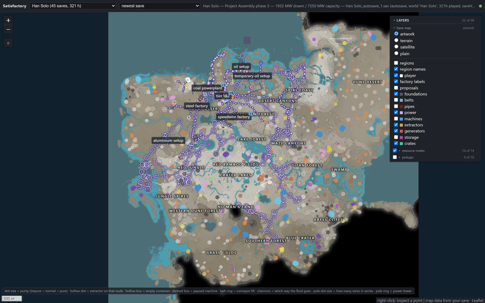
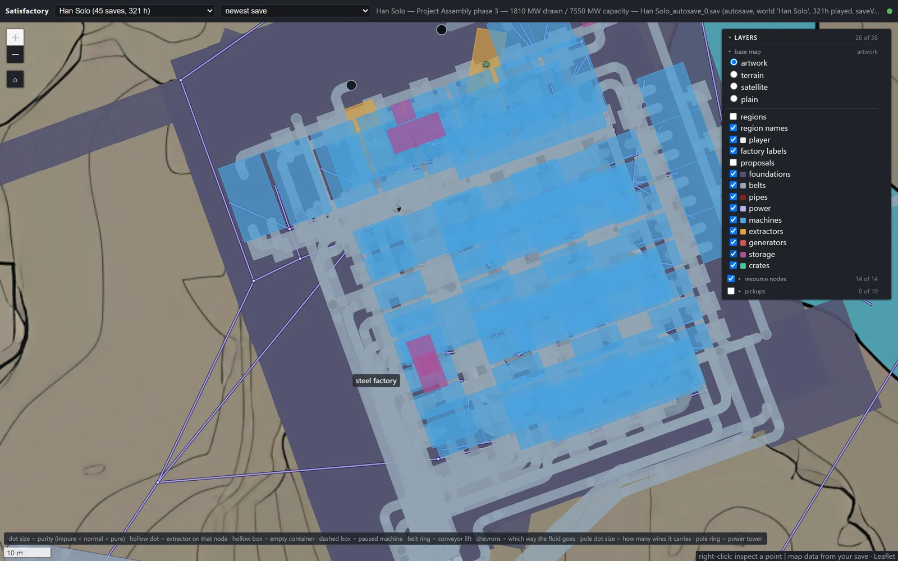
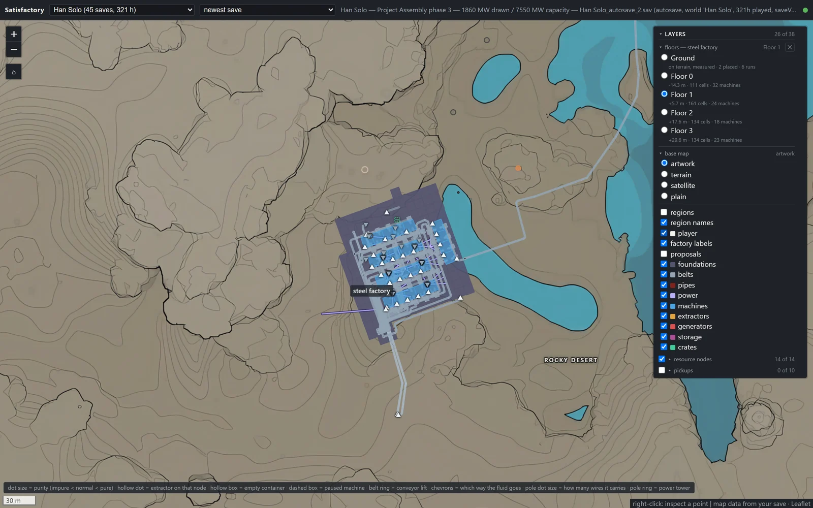
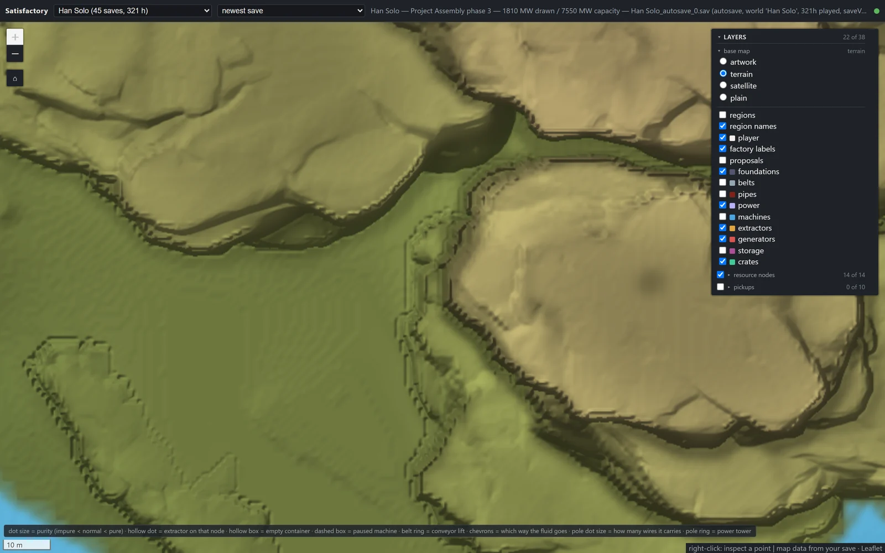
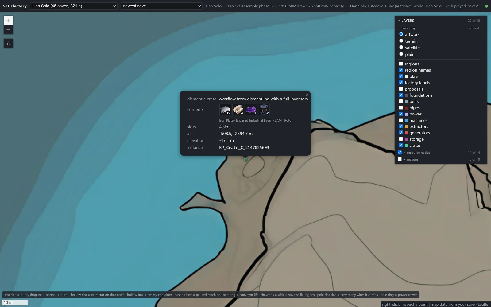

# SatisfactoryMCP

Ask Claude about **your** Satisfactory world — and get answers read straight from your own
save files. This is an MCP server plus a local web map: the server plans factories with a real
optimizer over the game's own recipe data and your actual progress, and the map renders your
world in the browser — terrain, factories, belts and pipes, power wiring, floors, crates.
Everything runs locally; nothing is fetched from the network.



| | |
| --- | --- |
|  *One platform up close — machines, storage, belts, pipes, wires* |  *Floor view — pick a storey, see what stands on it* |
|  *Terrain mode — hillshade from a 1 m heightfield read out of the game* |  *A crate's contents, with icons extracted from the game's assets* |

## What you can ask

Phrased however you like — the model picks the tools:

- *"Plan a factory for 20 Modular Frames per minute using only recipes I've actually unlocked —
  what do I build, and how much power will it draw?"*
- *"Which of my pending hard drives should I bank first, and why?"*
- *"How healthy is my steel factory right now? Anything idle or starved?"*
- *"Where am I standing, and what's the best spot near me for an aluminium setup?"*
- *"What's still missing for Phase 3, and which factory is the bottleneck?"*
- *"Trace my Reinforced Iron Plates upstream and tell me where the chain is thinnest."*
- *"Compare the alternate recipes for Computers against what I'm running today."*
- *"Show the coal powerplant on the map."* — answers with a link that opens the web map
  zoomed to it.

Plans balance every item honestly — a setup that would silently strand Heavy Oil Residue is
reported infeasible instead of overstated — and every answer names the save file it read and
how old it is. The server only ever *reads* your saves; it never writes them.

<details>
<summary><b>The full tool list</b> (42 tools, 3 slash-command prompts)</summary>

| Area | Tools |
| --- | --- |
| Game data | `search_items`, `search_recipes`, `recipe_detail`, `alternates_for_item`, `list_buildings` |
| Your world | `list_worlds`, `world_summary`, `unlocked_recipes`, `power_report`, `factory_sites`, `whereami`, `phase_requirements`, `power_shards`, `collected_from_world`, `mam_research`, `somersloops` |
| Your factories | `list_factories`, `name_factory`, `forget_factory`, `factory_health`, `factory_map`, `factory_query`, `propose_factories`, `select_machines`, `trace_upstream` |
| Map | `list_regions`, `describe_location`, `search_resource_nodes`, `rank_build_sites`, `show_on_map` |
| Planning | `plan_factory`, `plan_layout`, `commission_plan`, `diff_vs_save`, `bom`, `explain_byproducts`, `compare_recipe_options`, `rank_unlocks`, `list_plans`, `forget_plan` |
| Hard drives | `list_pending_hard_drive_choices`, `advise_hard_drive_pick` |

Plus MCP resources (`satisfactory://docs/summary`, `satisfactory://save/current`,
`satisfactory://map/regions`) and three prompts that surface as slash commands:
`design_factory`, `plan_power_plant`, `pick_hard_drive`. The full surface, argument by
argument, is in [docs/mcp-surface.md](docs/mcp-surface.md).

</details>

## Getting started

You need:

- **Python ≥ 3.11** and [uv](https://docs.astral.sh/uv/)
- **A local Satisfactory installation** (Steam or Epic) — recipes and rates are read from the
  game's own data dump, so numbers stay correct when the game patches
- **Node.js** — only to build the web map once; not needed for the MCP server alone
- **Windows** is what it's developed and tested on; save and install auto-detection assume
  Windows paths, and both can be pointed elsewhere via environment variables (below)

```bash
git clone https://github.com/lukszi/SatisfactoryMCP.git
cd SatisfactoryMCP
uv sync
```

### Connect it to Claude

The MCP entry point is `satisfactory-mcp` (stdio). With Claude Code, register it at user scope
so it loads in any directory — you'll usually be asking about the game, not about this code:

```bash
claude mcp add --scope user satisfactory -- uv run --directory "/path/to/SatisfactoryMCP" satisfactory-mcp
```

For any other MCP client, the equivalent JSON configuration:

```json
{
  "mcpServers": {
    "satisfactory": {
      "command": "uv",
      "args": ["run", "--directory", "/path/to/SatisfactoryMCP", "satisfactory-mcp"]
    }
  }
}
```

### The web map

Build the page once, then start the server:

```bash
cd src/satisfactory_mcp/interfaces/web/frontend
npm ci && npm run build
cd -
uv sync --extra web
uv run satisfactory-mcp-web
```

The map is at <http://127.0.0.1:8712>, and it follows your saves live as you play. It binds to
localhost on purpose: the API answers with the contents of your save directory and has no
authentication, so it is a local tool.

### Where your saves come from

Both locations are auto-detected:

- **Saves**: `%LOCALAPPDATA%\FactoryGame\Saved\SaveGames` — the game's own location. Override
  with `SATISFACTORY_SAVES`.
- **Game data**: `CommunityResources/Docs/en-US.json` under common Steam and Epic install
  paths. Override with `SATISFACTORY_DOCS` (pointing at the `en-US.json` file itself).

Saves are grouped into worlds; within a world the newest save is used by default, and every
answer says which file it read.

## Licence

**[PolyForm Noncommercial 1.0.0](LICENSE).** Free to use, modify and share for any
noncommercial purpose, provided the required notice travels with copies:

> Required Notice: Copyright Lukas Szimtenings (https://github.com/lukszi/SatisfactoryMCP)

Commercial use requires a separate licence from the owner — get in touch via GitHub
([@lukszi](https://github.com/lukszi)). The licence covers this repository's code, tooling and
extracted tables; it cannot and does not grant anyone rights over the game's content. All
game-derived data describes Coffee Stain Studios' content — Coffee Stain retains all rights to
Satisfactory and its assets, and this project is not affiliated with or endorsed by them.

The web map compiles [Leaflet](https://leafletjs.com/) (BSD-2-Clause) into its bundle at build
time from the npm package; the bundle is not committed, and every build carries Leaflet's
licence text beside it.

---

*Developing: the code layout, test suite, data generators, and the full data-provenance record
live in [docs/DEVELOPING.md](docs/DEVELOPING.md). [DESIGN.md](DESIGN.md) is the design spine.*
